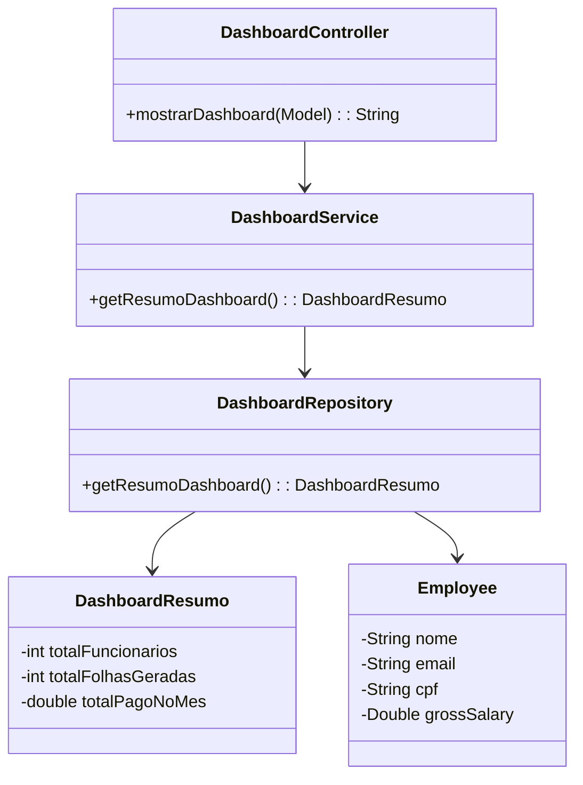

# 📊 Módulo Dashboard – Documentação Técnica

## Visão Geral

O **Módulo Dashboard** é responsável por centralizar e exibir informações consolidadas sobre o sistema de gestão de RH, como número de funcionários, folhas geradas e total pago no mês.  
Ele segue a **arquitetura MVC (Model–View–Controller)** e utiliza as camadas **Repository**, **Service** e **Controller**, mantendo a aplicação modular, escalável e de fácil manutenção.

O objetivo do módulo é **prover uma visão gerencial resumida** dos dados disponíveis no sistema, permitindo que a interface web apresente informações de forma clara e dinâmica utilizando **Spring Boot** e **Thymeleaf**.

---

## 1. Estrutura do Módulo

| Camada | Classe/Arquivo | Responsabilidade Principal |
|:---|:---|:---|
| **Model** | `DashboardResumo` | Representa os dados exibidos no dashboard (funcionários, folhas, total pago). |
| **Repository** | `DashboardRepository` | Simula a origem dos dados e gera estatísticas. |
| **Service** | `DashboardService` | Contém a lógica de negócio para processar e entregar as informações ao controlador. |
| **Controller** | `DashboardController` | Controla as requisições HTTP e repassa os dados ao template HTML. |
| **View** | `dashboard.html` | Página renderizada pelo Thymeleaf que exibe os dados do resumo de forma visual. |

---

## 2. Estrutura de Código

### 🧩 Model: `DashboardResumo.java`
```java
package io.github.progmodular.gestaorh.model.entities;

import lombok.AllArgsConstructor;
import lombok.Data;
import lombok.NoArgsConstructor;

@Data
@AllArgsConstructor
@NoArgsConstructor
public class DashboardResumo {
    private int totalFuncionarios;
    private int totalFolhasGeradas;
    private double totalPagoNoMes;
}
```

### 🧩 Repository: `DashboardRepository.java`

```java
package io.github.progmodular.gestaorh.repository;

import io.github.progmodular.gestaorh.model.entities.Employee;
import org.springframework.stereotype.Repository;

import java.util.Arrays;
import java.util.List;

@Repository
public class DashboardRepository {

    private final List<Employee> employees = Arrays.asList(
            new Employee("Maria Silva", "maria@empresa.com", "123", "senha123",
                    4200.00, "123.456.789-00", "Analista de RH", 160.0, 22),
            new Employee("João Pereira", "joao@empresa.com", "124", "senha123",
                    3800.00, "987.654.321-00", "Assistente Administrativo", 168.0, 21),
            new Employee("Ana Souza", "ana@empresa.com", "125", "senha123",
                    5200.00, "456.789.123-00", "Coordenadora de DP", 172.0, 22)
    );

    public DashboardResumo getResumoDashboard() {
        int totalFuncionarios = employees.size();
        int totalFolhasGeradas = employees.size();
        double totalPago = employees.stream().mapToDouble(Employee::getGrossSalary).sum();
        return new DashboardResumo(totalFuncionarios, totalFolhasGeradas, totalPago);
    }

    public List<Employee> getFuncionarios() {
        return employees;
    }
}
``` 

### 🧩 Service: `DashboardService.java`

```java
package io.github.progmodular.gestaorh.service;

import org.springframework.stereotype.Service;

@Service
public class DashboardService {

    private final DashboardRepository dashboardRepository;

    public DashboardService(DashboardRepository dashboardRepository) {
        this.dashboardRepository = dashboardRepository;
    }

    public DashboardResumo getResumoDashboard() {
        return dashboardRepository.getResumoDashboard();
    }
}

``` 

### 🧩 Controller: `DashboardController.java`

```java

package io.github.progmodular.gestaorh.controller;

import org.springframework.stereotype.Controller;
import org.springframework.ui.Model;
import org.springframework.web.bind.annotation.GetMapping;

@Controller
public class DashboardController {

    private final DashboardService dashboardService;

    public DashboardController(DashboardService dashboardService) {
        this.dashboardService = dashboardService;
    }

    @GetMapping("/dashboard")
    public String mostrarDashboard(Model model) {
        model.addAttribute("info", dashboardService.getResumoDashboard());
        return "dashboard";
    }
}
```
###
🖥️ View: `Dashboard.html`
```html
<!DOCTYPE html>
<html xmlns:th="http://www.thymeleaf.org">
<head>
    <meta charset="UTF-8">
    <title>Dashboard</title>
    <style>
        body {
            font-family: 'Segoe UI', sans-serif;
            background-color: #f7f8fa;
            margin: 0;
            padding: 20px;
            color: #333;
        }
        h1 {
            text-align: center;
            color: #444;
        }
        .card {
            background: white;
            border-radius: 10px;
            box-shadow: 0 3px 6px rgba(0,0,0,0.1);
            padding: 20px;
            margin: 20px auto;
            width: 400px;
        }
        .card p {
            font-size: 1.1rem;
            margin: 10px 0;
        }
        .highlight {
            color: #007acc;
            font-weight: bold;
        }
    </style>
</head>
<body>
    <h1>Resumo do Sistema</h1>
    <div class="card">
        <p><strong>Total de Funcionários:</strong> <span th:text="${info.totalFuncionarios}" class="highlight"></span></p>
        <p><strong>Total de Folhas Geradas:</strong> <span th:text="${info.totalFolhasGeradas}" class="highlight"></span></p>
        <p><strong>Total Pago no Mês:</strong> R$ <span th:text="${info.totalPagoNoMes}" class="highlight"></span></p>
    </div>
</body>
</html>
```

---

## 3. Fluxo de Arquitetura MVC

1. O **usuário acessa** a rota `/dashboard`
2. O **Controller** recebe a requisição HTTP e aciona o **Service**
3. O **Service** consulta o **Repository** para obter os dados
4. O **Repository** retorna um objeto `DashboardResumo`
5. O **Controller** adiciona esse objeto no **Model**
6. O **Thymeleaf (View)** renderiza os dados no arquivo `dashboard.html`

---

## 4. Diagrama UML do Módulo Dashboard



---

## 5. Requisitos Atendidos e Boas Práticas Aplicadas

| Tipo | Descrição |
|------|-----------|
| ✅ RF – Requisito Funcional | Exibe um resumo gerencial do sistema de RH |
| ✅ RF – Integração Web | Disponibiliza rota `/dashboard` funcional |
| ✅ RNF – Manutenibilidade | Código organizado em camadas MVC com baixo acoplamento |
| ✅ RNF – Clareza Estrutural | Separação de responsabilidades entre Controller, Service e Repository |
| ✅ RNF – Testabilidade | Estrutura facilita criação de testes unitários |
| ✅ Boas práticas | Uso de injeção de dependência (@Autowired via construtor) |
| ✅ Boas práticas | Uso de Lombok para reduzir código repetitivo |
| ✅ Boas práticas | Segue princípio SRP e DRY |
| ✅ Documentação | Fácil integração e entendimento por novos membros do time |

---

## 6. Possíveis Evoluções Futuras

| Evolução Planejada | Benefício Futuro |
|--------------------|------------------|
| Substituir dados simulados por banco real (MySQL) | Permitir que a dashboard exiba dados reais do sistema |
| Adicionar novos indicadores (ex: média salarial, absenteísmo) | Ampliar utilidade gerencial |
| Criar gráficos de visualização (Chart.js) | Tornar a interface mais intuitiva |
| Implementar filtro por períodos | Comparativos mensais e anuais |
| Gerar relatórios em PDF/CSV | Exportação de informações |
| Controle de acesso baseado em nível de usuário | Restringir visualização a gestores/admins |
| Tornar a dashboard responsiva | Melhorar usabilidade em dispositivos móveis |

---

## 7. Conclusão

O **Módulo Dashboard** cumpre sua função dentro do sistema, exibindo informações essenciais de forma rápida e estruturada.  
A arquitetura utilizada permite **crescimento sustentável**, mantendo clareza no fluxo de dados e na divisão de responsabilidades entre as camadas.

Com base no que foi desenvolvido até aqui, o módulo já está:

✅ Funcional  
✅ Integrado ao projeto  
✅ Preparado para receber banco de dados real  
✅ Com código limpo e organizado  
✅ Pronto para evoluir nas próximas sprints

Ele também segue boas práticas profissionais de backend, tornando o sistema **mais confiável, escalável e fácil de manter**.

---
